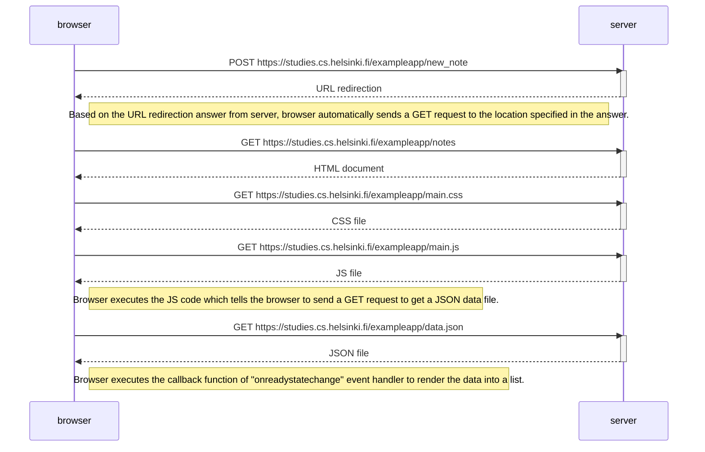

```mermaid
sequenceDiagram
  participant browser
  participant server
  
  browser->>server: POST https://studies.cs.helsinki.fi/exampleapp/new_note
  activate server
  server-->>browser: URL redirection
  deactivate server
  
  Note right of browser: Based on the URL redirection answer from server, browser automatically sends a GET request to the location specified in the answer.
  
  browser->>server: GET https://studies.cs.helsinki.fi/exampleapp/notes
  activate server
  server-->>browser: HTML document
  deactivate server
  
  browser->>server: GET https://studies.cs.helsinki.fi/exampleapp/main.css
  activate server
  server-->>browser: CSS file
  deactivate server
  
  browser->>server: GET https://studies.cs.helsinki.fi/exampleapp/main.js
  activate server
  server-->>browser: JS file
  deactivate server
  
  Note right of browser: Browser executes the JS code which tells the browser to send a GET request to get a JSON data file.
  
  browser->>server: GET https://studies.cs.helsinki.fi/exampleapp/data.json
  activate server
  server-->>browser: JSON file
  deactivate server
  
  Note right of browser: Browser executes the callback function of "onreadystatechange" event handler to render the data into a list.
```
