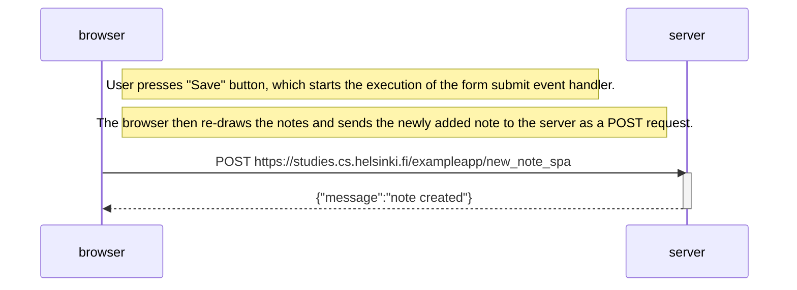

```mermaid
sequenceDiagram
  participant browser
  participant server
  
  Note right of browser: User presses "Save" button, which starts the execution of the form submit event handler.
  Note right of browser: The browser then re-draws the notes and sends the newly added note to the server as a POST request.
  
  browser->>server: POST https://studies.cs.helsinki.fi/exampleapp/new_note_spa
  activate server
  server-->>browser: {"message":"note created"}
  deactivate server
```
